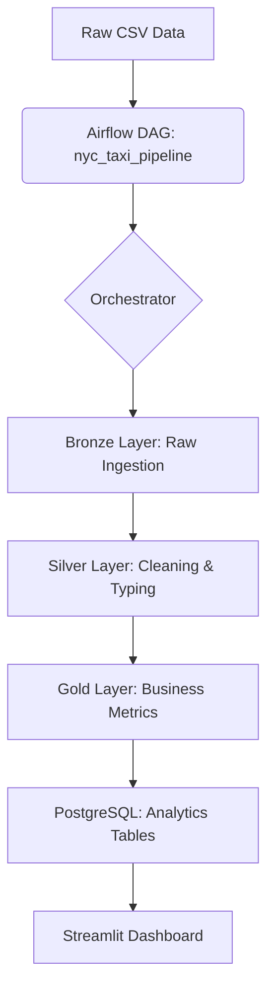

# 🚖 NYC Yellow Taxi Data Engineering Pipeline

An end-to-end batch processing pipeline for NYC Yellow Taxi data, transforming 11M+ raw records into actionable business insights using a modern data stack.

[](https://python.org)
[](https://airflow.apache.org)
[](https://www.astronomer.io/runtime/)
[](https://www.postgresql.org/)
[](https://streamlit.io)
[](LICENSE)

---

## 📖 Overview

This project implements a robust **Medallion Architecture** to process massive datasets from the NYC Taxi & Limousine Commission (TLC). By leveraging **Apache Airflow (Astro Runtime)** for containerized orchestration and **PostgreSQL** as the OLAP engine, the pipeline ensures a scalable and reproducible development environment via **WSL2** and **Docker**.

### Key Objectives
*   **Scalable Orchestration:** Full lifecycle management of data tasks via Airflow DAGs.
*   **Data Quality:** Rigorous cleaning and validation layers (Bronze, Silver, Gold).
*   **Infrastructure as Code:** Fully containerized environment including a dedicated Postgres instance.
*   **Performance:** Optimized for handling 11M+ records using localized processing layers.
*   **Traceability:** Maintain full data lineage with ingestion metadata in the Bronze layer.
*   **Accessibility:** Provide an interactive dashboard for stakeholders to explore KPIs.

---

## 📋 Table of Contents

- [📊 Performance Highlights](#-performance-highlights)
- [🏗️ Architecture Overview](#-architecture-overview)
- [🛠️ Tech Stack & Setup](#-tech-stack--setup)
- [📁 Project Structure](#-project-structure)
- [🚀 Execution Guide](#-execution-guide)
- [📐 Data Pipeline (Medallion)](#-data-pipeline-medallion)
- [📈 Business Insights](#-business-insights)
- [🧮 Semantic Layer](#-semantic-layer)
- [📸 Visualization](#-visualization)

---

## 📊 Performance Highlights

| Metric         | Result                                              |
|:---------------|:----------------------------------------------------|
| **Throughput** | **11,308,680** records processed (Feb 2016)         |
| **Efficiency** | **~72% storage reduction** via Parquet + Snappy     |
| **Latency**    | **< 1s** analytical query response time             |
| **Accuracy**   | **255,326** invalid records identified and filtered |
| **Financials** | **$139.9M** in total revenue analyzed               |

---

## 🏗️ Architecture Overview

The pipeline follows a batch ETL pattern, ensuring modularity and clear separation of concerns across layers.



1.  **Bronze Layer:** Raw ingestion of CSV data. All fields are treated as TEXT to ensure no data is lost during the initial load.
2.  **Silver Layer:** Cleaned, typed, and validated data. Includes calculated fields like `trip_duration_min`.
3.  **Gold Layer:**  Aggregated business metrics, optimized for consumption by dashboards like Streamlit.

---

## 🛠️ Tech Stack & Setup

### Core Technologies
*   **Orchestration:** Apache Airflow (Astro Runtime 13.6)
*   **Database:** PostgreSQL 13
*   **Processing:** SQL + Python (Pandas)
*   **Containerization:** Docker + Docker Compose + WSL2
*   **Dashboard:** Streamlit
*   **Package Manager:** `uv` for high-speed Python package handling

### System Requirements
*   **Python 3.11+**
*   Docker, WSL2 (for Windows environments), UV (for fast dependency management).

---

## 📁 Project Structure

```bash
nyc-yellow-taxi-data-engineering-pipeline/
├── dags/                        # Airflow DAGs (main pipeline orchestration)
│
├── include/                     # Supporting layer (SQL, helpers, and business logic)
│   ├── data/                    # Local ingestion files (CSV / Parquet)
│   ├── sql/                     # SQL scripts (Bronze → Silver → Gold transformations)
│
├── plugins/                     # Custom Airflow operators and extensions
│
├── tests/                       # Unit tests (data quality and transformation validation)
│
├── dashboard.py                 # Streamlit BI dashboard application
│
├── init.sh                      # Environment bootstrap script (local setup automation)
│
├── docker-compose.yml           # Multi-container orchestration (Airflow + PostgreSQL)
├── Dockerfile                   # Custom Astro Runtime image
├── pyproject.toml              # Dependency management (uv)
├── init-db.sql                 # Database initialization scripts
└── README.md                   # Project documentation
```

---

## 🚀 Execution Guide

### 1. Environment Setup

```bash
git clone [https://github.com/alexandre-pedro/nyc-yellow-taxi-pipeline.git](https://github.com/alexandre-pedro/nyc-yellow-taxi-pipeline.git)
cd nyc-yellow-taxi-data-engineering-pipeline
cp .env.example .env
```

### 2. Start Infrastructure

```bash
docker compose up -d
```

Access the Airflow UI at: http://localhost:8088
Login: `admin` / `admin`

### 3. Running Transformations

The DAG will automatically handle the progression through the layers:

- **Bronze:** Ingests raw CSVs into Postgres with metadata.
- **Silver:** Performs data typing and outlier removal.
- **Gold:** Generates business-ready marts.

### 4. Launch Dashboard

```bash
uv run streamlit run dashboard.py
```

---

## 📐 Data Pipeline (Medallion)

### 🥉 Bronze: Ingestion

Initial landing zone. Data is ingested as `TEXT` to prevent loss, adding `ingested_at` timestamps for traceability.

### 🥈 Silver: Quality Assurance

Filters out negative fares, invalid coordinates, and enforces strict schemas using SQL and Python.

### 🥇 Gold: Business Marts

High-level summaries optimized for visualization:
*   `mrt_daily_summary`: Aggregated daily KPIs.
*   `mrt_hourly_demand`: Demand patterns by hour and day.
*   `mrt_top_zones`: Payment type breakdowns and regional performance.

---

## 📈 Business Insights

### Payment Behavior
| Payment Type    | Trip Volume | Market Share | Avg. Fare | Total Revenue |
|:----------------|:------------|:-------------|:----------|:--------------|
| **Credit Card** | 7.65M       | **67.69%**   | $12.80    | $97.96M       |
| **Cash**        | 3.61M       | **31.94%**   | $11.42    | $41.24M       |

### Temporal Trends
*   **Peak Demand:** 6 PM – 10 PM accounts for **32% of total daily volume**.
*   **Efficiency:** Average speed and tip percentages fluctuate significantly during rush hours.

---

## 📸 Visualization

The **Streamlit Dashboard** provides:
*   **Real-time KPIs:** Instant visibility into revenue and trip volume.
*   **Geospatial Analysis:** Heatmaps identifying high-demand pickup/dropoff zones.
*   **Demand Forecasting:** Time-series analysis of historical trends.

---

## 📚 Data Source
Data provided by the [NYC Taxi & Limousine Commission (TLC)](https://www.nyc.gov/site/tlc/about/tlc-trip-record-data.page).

## 📄 License
This project is licensed under the **MIT License**.

---
*Built with ❤️ using the Modern Data Stack.*